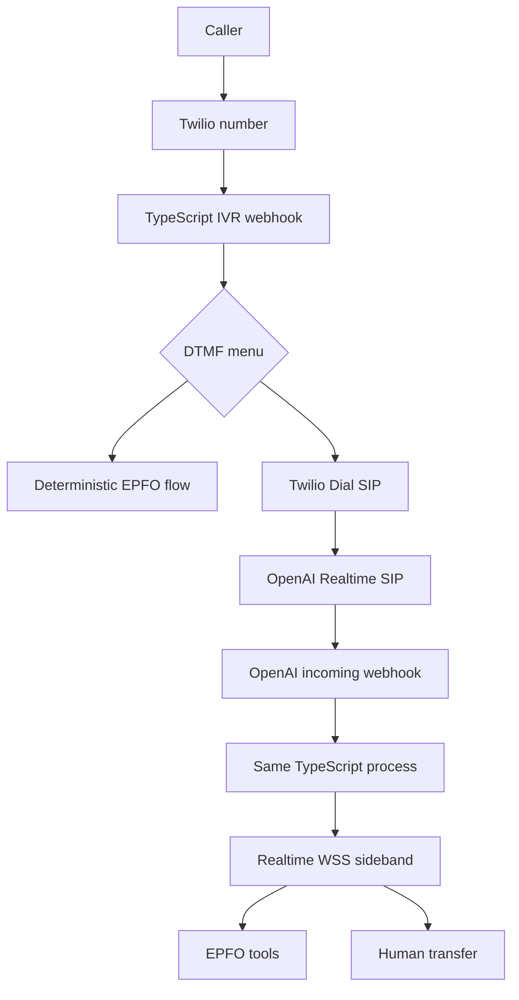

# EPFO Customer-Care Voice Platform
## Twilio IVR + OpenAI Realtime SIP Agent

**Status:** Production implementation specification  
**Stack:** TypeScript / Node.js / Express or Fastify  
**Telephony:** Twilio Programmable Voice + Elastic SIP Trunking  
**Agent:** OpenAI Realtime API, `gpt-realtime-2.1`  
**Deployment model:** One TypeScript service

## 1. Goal

Create a hybrid EPFO customer-care call flow:

- Twilio owns the deterministic IVR and DTMF navigation.
- Known, structured requests can be handled by deterministic EPFO backend flows.
- Pressing `0` connects the active caller to an OpenAI Realtime agent over SIP.
- The agent uses server-side tools for EPFO lookups and actions.
- The agent can transfer the caller to a human representative.
- Every call, IVR action, AI session, tool call, and escalation is tied to one internal `interaction_id`.

The authorization model remains:

`Identity → Context → Role → Permission → Service`

UAN, establishment ID, branch, region, office, and extension scope are context or authorization data—not interchangeable identity values.

## 2. Target architecture



The application is one deployable service containing:

- Twilio webhook routes and TwiML generation
- Twilio signature validation
- OpenAI webhook verification
- OpenAI call acceptance and transfer operations
- Realtime WSS connection workers
- EPFO tool execution
- Call state and audit persistence
- Logging, metrics, tracing, and redaction

A separate microservice is not required. The WSS client runs inside this same process.

## 3. Routing rule

The main public Twilio number must point to the TypeScript Voice webhook. Do not attach that number directly to the OpenAI SIP trunk, otherwise all calls bypass the IVR.

The flow is:

`Caller → Twilio IVR → Press 0 → Twilio <Dial><Sip> → OpenAI SIP → Realtime agent`

Use the existing OpenAI SIP URI:

`sip:proj_xxxxx@sip.api.openai.com;transport=tls`

Twilio `<Gather>` collects keypad input, while `<Dial><Sip>` routes the active call to the SIP endpoint. References:

- [Twilio Gather](https://www.twilio.com/docs/voice/twiml/gather)
- [Twilio Dial](https://www.twilio.com/docs/voice/twiml/dial)
- [Twilio Sip](https://www.twilio.com/docs/voice/twiml/sip)
- [OpenAI Realtime SIP](https://developers.openai.com/api/docs/guides/realtime-sip)

## 4. Resources and environment

Required:

- Production Twilio voice number for the IVR.
- Twilio Voice webhook URL.
- Elastic SIP Trunking configured for the OpenAI SIP endpoint.
- OpenAI `realtime.call.incoming` webhook.
- Durable database.
- Redis or equivalent for idempotency and locks.
- Public HTTPS endpoint.

```env
NODE_ENV=production
PORT=8000
PUBLIC_BASE_URL=https://voice.example.gov.in

TWILIO_ACCOUNT_SID=AC...
TWILIO_AUTH_TOKEN=...
TWILIO_IVR_NUMBER=+91...
TWILIO_HUMAN_QUEUE_NUMBER=+91...

OPENAI_API_KEY=sk-proj-...
OPENAI_WEBHOOK_SECRET=whsec...
OPENAI_PROJECT_ID=proj_...
OPENAI_REALTIME_MODEL=gpt-realtime-2.1
OPENAI_REALTIME_VOICE=cedar
OPENAI_SIP_URI=sip:proj_...@sip.api.openai.com;transport=tls

DATABASE_URL=...
REDIS_URL=...
EPFO_API_BASE_URL=...
EPFO_API_TOKEN=...
```

Use a secret manager in production. Never expose OpenAI or EPFO credentials to the caller.

## 5. Project structure

```text
src/
  app.ts
  server.ts
  config.ts
  routes/
    twilio-voice.routes.ts
    openai-webhook.routes.ts
    health.routes.ts
  telephony/
    twiml.service.ts
    twilio-signature.middleware.ts
    call-state.service.ts
    handoff.service.ts
  realtime/
    openai-client.ts
    realtime-call.service.ts
    realtime-ws.service.ts
    realtime-events.ts
    agent-instructions.ts
    tool-registry.ts
  epfo/
    epfo-api.client.ts
    epfo-tools.ts
    identity-verification.service.ts
    authorization.service.ts
  persistence/
    call-session.repository.ts
    audit.repository.ts
  observability/
    logger.ts
    metrics.ts
    tracing.ts
```

## 6. Call lifecycle

### 6.1 Incoming Twilio call

`POST /twilio/voice/incoming`

1. Validate the Twilio signature.
2. Generate `interaction_id`.
3. Persist Twilio `CallSid` and a keyed hash of `From`.
4. Set phase to `IVR`.
5. Return the welcome menu TwiML.

### 6.2 Initial IVR

Recommended menu:

`Press 1 for claim status.
Press 2 for passbook information.
Press 3 for pension information.
Press 4 for grievance status.
Press 0 to speak with our customer-care assistant.
Press 9 to repeat this menu.`

Use one DTMF digit, an explicit timeout, and a maximum retry count. Store retry count in shared state, not only memory.

### 6.3 Press 0 handoff

On `Digits=0`:

1. Set phase to `HANDOFF_REQUESTED`.
2. Play a short hold message.
3. Return TwiML with `<Dial answerOnBridge="true">`.
4. Dial the OpenAI SIP URI.
5. Supply a Twilio `action` URL for dial status.
6. Keep the original caller leg active while the SIP leg is established.

```xml
<Response>
  <Say>Please hold while we connect you to our customer-care assistant.</Say>
  <Dial answerOnBridge="true" timeout="30"
        action="/twilio/voice/ai-dial-status">
    <Sip>sip:proj_xxxxx@sip.api.openai.com;transport=tls</Sip>
  </Dial>
</Response>
```

### 6.4 OpenAI incoming webhook

`POST /openai/webhooks`

OpenAI emits `realtime.call.incoming` with a `call_id`.

The handler must:

- Verify the signature from the raw request body.
- Apply event-id idempotency.
- Persist the OpenAI `call_id` against the interaction.
- Accept the call with `gpt-realtime-2.1`.
- Start a WSS worker.
- Return quickly; never hold the webhook request for the call duration.

### 6.5 Realtime WSS

Connect to:

`wss://api.openai.com/v1/realtime?call_id=CALL_ID`

The WSS worker:

- Sends session instructions.
- Sends the opening greeting.
- Receives function calls.
- Executes authorized EPFO tools.
- Returns `function_call_output`.
- Sends `response.create`.
- Monitors errors, interruptions, and close events.
- Stops after terminal call state.

See [OpenAI server-side controls](https://developers.openai.com/api/docs/guides/realtime-server-controls).

## 7. Domain interfaces

```ts
export type CallPhase =
  | 'IVR'
  | 'HANDOFF_REQUESTED'
  | 'AI_CONNECTING'
  | 'AI_ACTIVE'
  | 'VERIFICATION_REQUIRED'
  | 'HUMAN_TRANSFER_REQUESTED'
  | 'HUMAN_ACTIVE'
  | 'COMPLETED'
  | 'FAILED';

export interface CallSession {
  interactionId: string;
  twilioCallSid: string;
  openaiCallId?: string;
  callerPhoneHash?: string;
  ivrSelection?: string;
  preferredLanguage?: 'en-IN' | 'hi-IN' | 'hinglish';
  phase: CallPhase;
  verificationLevel: 'none' | 'phone' | 'member' | 'strong';
  contextId?: string;
  contextType?: 'member' | 'establishment' | 'employer' | 'branch';
  startedAt: string;
  endedAt?: string;
  lastEventAt: string;
  version: number;
}
```

Use optimistic versioning on every transition so duplicate webhook deliveries cannot overwrite newer state.

## 8. Twilio TypeScript implementation

Install:

```bash
npm install express twilio openai ws zod pino
npm install -D typescript tsx @types/express @types/ws
```

TwiML builder:

```ts
import { twiml } from 'twilio';

const { VoiceResponse } = twiml;

export function buildWelcomeMenu(): string {
  const response = new VoiceResponse();

  const gather = response.gather({
    input: ['dtmf'],
    numDigits: 1,
    timeout: 5,
    action: '/twilio/voice/menu',
    method: 'POST',
  });

  gather.say(
    { language: 'en-IN' },
    'Welcome to EPFO customer care. ' +
      'Press 1 for claim status. ' +
      'Press 2 for passbook information. ' +
      'Press 3 for pension information. ' +
      'Press 4 for grievance status. ' +
      'Press 0 to speak with our customer-care assistant.',
  );

  response.redirect({ method: 'POST' }, '/twilio/voice/welcome');
  return response.toString();
}

export function buildAiHandoff(): string {
  const response = new VoiceResponse();

  response.say(
    { language: 'en-IN' },
    'Please hold while we connect you to our customer-care assistant.',
  );

  const dial = response.dial({
    answerOnBridge: true,
    timeout: 30,
    action: '/twilio/voice/ai-dial-status',
    method: 'POST',
  });

  dial.sip(process.env.OPENAI_SIP_URI!);
  return response.toString();
}
```

Validate every Twilio request before trusting `Digits`, `CallSid`, `From`, or any other field.

## 9. OpenAI SDK and WebSocket boundary

Use the OpenAI Node SDK for:

- Client initialization.
- Webhook verification where exposed by the installed version.
- Realtime call REST operations where exposed by the installed version.
- Typed request construction.

Use `ws` in the same process for the sideband connection if the installed OpenAI Node SDK does not expose a stable SIP-call WebSocket helper. This is still a single service.

```ts
import WebSocket from 'ws';

export function connectToRealtimeCall(callId: string): WebSocket {
  return new WebSocket(
    'wss://api.openai.com/v1/realtime?call_id=' +
      encodeURIComponent(callId),
    {
      headers: {
        Authorization: 'Bearer ' + process.env.OPENAI_API_KEY,
      },
    },
  );
}
```

Pin and test the exact `openai` package version. Do not assume a method exists in TypeScript because it exists in another SDK language. The official WebSocket pattern is documented [here](https://developers.openai.com/api/docs/guides/realtime-websocket).

## 10. Realtime agent configuration

Accept the call with:

```ts
const acceptPayload = {
  type: 'realtime',
  model: 'gpt-realtime-2.1',
  voice: process.env.OPENAI_REALTIME_VOICE ?? 'cedar',
  instructions: buildAgentInstructions(session),
  tools: realtimeToolDefinitions,
};
```

Agent rules:

- Identify itself as an automated EPFO customer-care assistant.
- Ask what the caller needs.
- Support Hindi and English.
- Never guess account or case information.
- Use tools for account-specific answers.
- Ask for verification before protected lookups.
- Confirm before state-changing actions.
- Never reveal full UAN, Aadhaar, PAN, bank data, or internal IDs.
- Explain backend unavailability honestly.
- Escalate if requested, uncertain, distressed, or blocked.
- Keep responses short and telephone-friendly.
- Repeat important references slowly.

Function tools are appropriate because the application owns EPFO access and authorization. See [Realtime tools](https://developers.openai.com/api/docs/guides/realtime-mcp).

## 11. EPFO tools

### verify_member_identity

Input:

```ts
interface VerifyMemberIdentityInput {
  verificationMethod: 'mobile_otp' | 'uan_plus_secret' | 'member_details';
  uan?: string;
  answer?: string;
}
```

Return only a verification result and an internal member reference. Never return raw secrets.

### get_claim_status

Requires member-level verification. The server derives the member from the verified session; the model cannot provide an arbitrary member ID.

### get_passbook_summary

Requires member-level verification and returns a minimum necessary summary.

### get_pension_status

Requires the relevant verified pension context.

### get_grievance_status

Requires a verified grievance reference or member session.

### create_grievance

Requires strong verification and a final explicit confirmation immediately before creation. Use an idempotency key.

### transfer_to_human

```ts
interface TransferToHumanInput {
  reasonCode:
    | 'caller_requested'
    | 'verification_failed'
    | 'sensitive_case'
    | 'backend_unavailable'
    | 'agent_uncertain'
    | 'distress';
  summary: string;
}
```

The server—not the model—selects the queue and performs transfer.

## 12. Function-call loop

```text
response.function_call_arguments.done
        ↓
validate registered function and JSON schema
        ↓
load interaction session
        ↓
check verification and context permissions
        ↓
execute EPFO service call
        ↓
write audit event
        ↓
send conversation.item.create with function_call_output
        ↓
send response.create
```

Never execute an unregistered tool. Never pass raw database errors to the caller. Every mutating call must be idempotent.

## 13. Human handoff

When the caller requests a human or escalation rules trigger:

1. Ask permission where appropriate.
2. Generate a concise case summary.
3. Persist it against `interaction_id`.
4. Announce the transfer.
5. Call OpenAI SIP `refer` to the human queue URI or phone number.
6. Set phase to `HUMAN_TRANSFER_REQUESTED`.
7. Record success or failure.

OpenAI documents SIP transfer through the `refer` endpoint in the [Realtime SIP guide](https://developers.openai.com/api/docs/guides/realtime-sip).

If transfer fails, offer a callback or grievance route. Never silently hang up.

If the AI SIP leg fails, Twilio’s `/twilio/voice/ai-dial-status` handler should inspect `DialCallStatus`, retry at most once for a known transient failure, then use a human queue or callback fallback.

## 14. Identity, context, and authorization

The caller’s phone number is not sufficient for authorization.

Track:

- Caller phone hash.
- Verification level.
- Member reference.
- Establishment context.
- Region, office, establishment code, and extension scope.
- Current acting role/context.
- Allowed services.
- Verification timestamp.

The agent must make “Who am I acting as?” and relevant branch or establishment context explicit before scope-sensitive operations. Irreversible actions require confirmation and an audit event.

Authorization must be enforced in application code and EPFO services, not only in the prompt.

## 15. Persistence

### voice_interactions

```text
interaction_id       UUID primary key
twilio_call_sid      string unique
openai_call_id       string nullable unique
caller_phone_hash    string nullable
ivr_selection        string nullable
language             string nullable
phase                string
verification_level   string
context_id           string nullable
context_type         string nullable
started_at           timestamp
connected_at         timestamp nullable
ended_at             timestamp nullable
failure_code         string nullable
created_at           timestamp
updated_at           timestamp
version              integer
```

### voice_events

```text
event_id             UUID primary key
interaction_id       UUID
source               twilio | openai | application | epfo
event_type           string
provider_event_id    string nullable
payload_redacted     JSONB
occurred_at          timestamp
created_at           timestamp
```

Store transcripts or recordings only under an explicit retention policy. Redact UAN, Aadhaar, PAN, bank data, OTPs, tokens, and full phone numbers.

## 16. Required routes

```text
POST /twilio/voice/incoming
POST /twilio/voice/menu
POST /twilio/voice/ai-dial-status
POST /twilio/voice/human-transfer-status
POST /openai/webhooks
GET  /health/live
GET  /health/ready
```

Webhook requirements:

- HTTPS in production.
- Twilio signature validation.
- OpenAI webhook signature validation.
- Raw body preservation for OpenAI verification.
- Event-id idempotency.
- Fast responses; no call-duration HTTP requests.
- Stable absolute URLs.
- Request IDs and provider IDs in logs.

## 17. WSS reliability

Handle `open`, `message`, `error`, `close`, malformed JSON, unknown event types, idle timeouts, OpenAI errors, SIP hangup, and process shutdown.

Recommended policy:

```text
Connect timeout: 5 seconds
Initial retry: 500 ms
Backoff: exponential with jitter
Maximum retries: 3
Worker lifetime: call lifetime plus cleanup grace period
```

Do not reconnect after terminal call state. On process restart, recover only persisted `AI_CONNECTING` or `AI_ACTIVE` sessions after confirming the call is still live.

## 18. Security and privacy

- Separate staging and production Twilio/OpenAI projects.
- Use a secret manager.
- Validate both provider signatures.
- Apply request-size limits and rate limits.
- Never trust caller-provided UAN, establishment ID, or role.
- Enforce authorization in tools.
- Require confirmation for state changes.
- Redact sensitive values from logs, traces, and metrics.
- Audit verification, lookup, mutation, and transfer actions.
- Define transcript and recording retention/deletion.
- Use a privacy-preserving safety identifier where supported.
- Use least-privilege downstream EPFO credentials.

## 19. Observability

Log with:

`request_id, interaction_id, twilio_call_sid, openai_call_id,
phase, event_type, latency_ms`

Metrics:

- IVR completion and invalid-DTMF rate.
- Press-0 handoff rate.
- SIP connection success rate.
- Time from press 0 to agent greeting.
- Realtime duration.
- Tool latency and authorization failures.
- Human transfer and transfer failure rate.
- Backend error rate.
- Calls abandoned during handoff.
- Cost per resolved interaction.

Never use UAN, Aadhaar, PAN, or phone number as metric labels.

## 20. Testing

### Unit

- TwiML generation.
- Digit routing and retry bounds.
- Twilio and OpenAI signature validation.
- Tool schemas.
- Authorization.
- Redaction.
- State transitions and optimistic versioning.

### Integration

- Twilio webhook to IVR.
- Press 0 to SIP TwiML.
- OpenAI webhook to call acceptance.
- Call acceptance to WSS.
- WSS tool call to EPFO service and function output.
- AI-to-human transfer.
- SIP failure fallback.
- Duplicate webhook idempotency.

### Phone tests

- English and Hindi.
- Silence and interruption.
- Wrong verification.
- Human request.
- EPFO timeout.
- Duplicate webhook.
- WSS disconnect.
- Human queue unavailable.
- Caller hangup during ringing.

## 21. Deployment

Deploy one horizontally scalable stateless TypeScript service behind HTTPS.

Shared infrastructure:

- PostgreSQL or equivalent durable state.
- Redis for locks, idempotency, and coordination.
- Central logs, metrics, and traces.
- Secret manager.
- Stable public DNS.
- Outbound access to Twilio and OpenAI.
- Network access required by the SIP configuration.

In-memory state may be a cache only. Database/shared state is authoritative.

Graceful shutdown:

1. Stop accepting new webhooks.
2. Persist in-flight webhook work.
3. Close WSS workers cleanly.
4. Release distributed locks.
5. Exit after a bounded timeout.

## 22. Delivery phases

### Phase 1: IVR

- Point the main Twilio number to the TypeScript webhook.
- Implement menu, retries, and deterministic routes.
- Validate signatures.
- Persist interactions.

### Phase 2: OpenAI handoff

- Add `<Dial><Sip>` on digit 0.
- Verify `realtime.call.incoming`.
- Accept with `gpt-realtime-2.1`.
- Start WSS.
- Play the agent greeting.

### Phase 3: EPFO tools

- Identity verification.
- Claim, passbook, pension, and grievance reads.
- Authorization and audit.
- Hindi/English behavior.

### Phase 4: Escalation

- Human transfer tool.
- SIP REFER or selected queue route.
- Transfer failure fallback.

### Phase 5: Hardening

- Redis idempotency and locks.
- Metrics and tracing.
- Retention/redaction policy.
- Failure, load, and real-phone testing.
- Staging/production isolation.

## 23. Acceptance criteria

The milestone is complete when:

- The caller reaches the Twilio IVR.
- Digits 1–4 follow deterministic routes.
- Digit 0 connects the caller through SIP.
- OpenAI webhook signatures are verified.
- The call is accepted with `gpt-realtime-2.1`.
- The same TypeScript process maintains WSS.
- At least one protected EPFO lookup works through a server-side tool.
- Duplicate webhook delivery creates one session.
- Failed verification blocks protected data.
- Human transfer works or safely falls back.
- SIP, WSS, tool, and transfer failures are observable.
- Sensitive data is redacted.
- The complete interaction is reconstructable using `interaction_id`.

## 24. References

- [Twilio OpenAI Realtime SIP tutorial](https://www.twilio.com/en-us/blog/developers/tutorials/product/openai-realtime-api-elastic-sip-trunking)
- [Twilio Gather](https://www.twilio.com/docs/voice/twiml/gather)
- [Twilio Dial](https://www.twilio.com/docs/voice/twiml/dial)
- [Twilio Sip](https://www.twilio.com/docs/voice/twiml/sip)
- [OpenAI Realtime SIP](https://developers.openai.com/api/docs/guides/realtime-sip)
- [OpenAI Realtime WebSocket](https://developers.openai.com/api/docs/guides/realtime-websocket)
- [OpenAI server-side controls](https://developers.openai.com/api/docs/guides/realtime-server-controls)
- [OpenAI Realtime tools](https://developers.openai.com/api/docs/guides/realtime-mcp)
- [OpenAI Realtime conversations](https://developers.openai.com/api/docs/guides/realtime-conversations)

